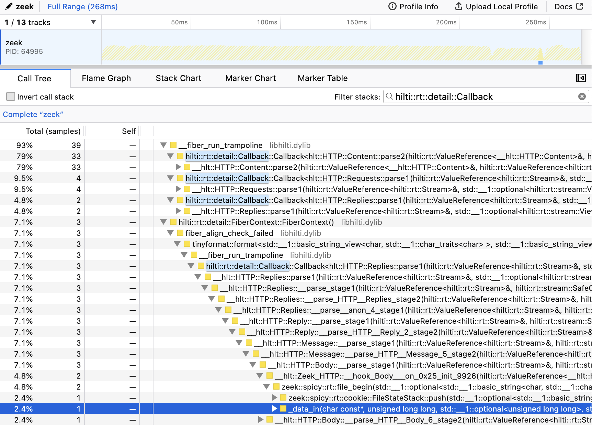
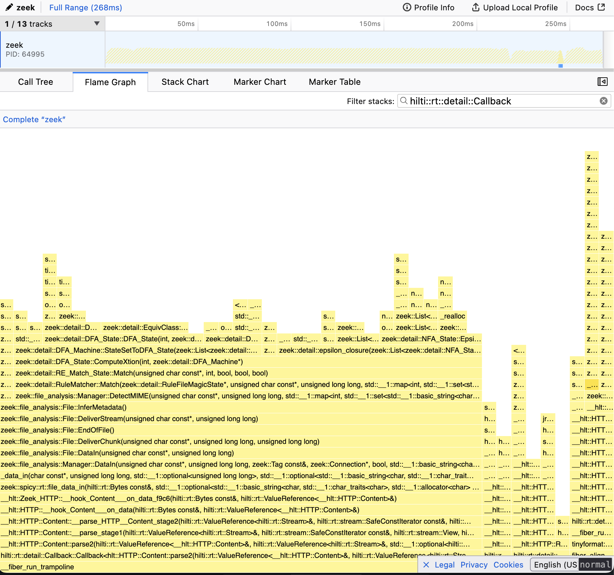

# Low-level profiling with standard system tools

Since Spicy just emits C++ code one can use standard system tools like e.g.,
`perf` to collect profiling information.

```admonish info
`perf` in particular can hooks into the kernel and might require small kernel-level adjustments.
```

In its default configuration `spicyc`/`spicyz` build in the mode they were
themself compiled in. For upstream packages this means unstripped release
binaries which expose names of called functions, but not per-line information
for e.g., `perf annotate`.

```console
zeek -Cr tests/traces/http-non-default-port.pcap build/http.hlto analyzer
```

Example flamegraphs displayed with
[`samply`](https://github.com/mstange/samply/) zooming in on just code running
as part of Spicy parsers (<1% of total elapsed time):

```admonish hint
Spicy parsers run on a fiber abstraction which can confuse tools like `perf
annotate` which attempt to restore stack traces. The code to look for is
anything running below a `hilti::rt::detail::Callback`.
```



