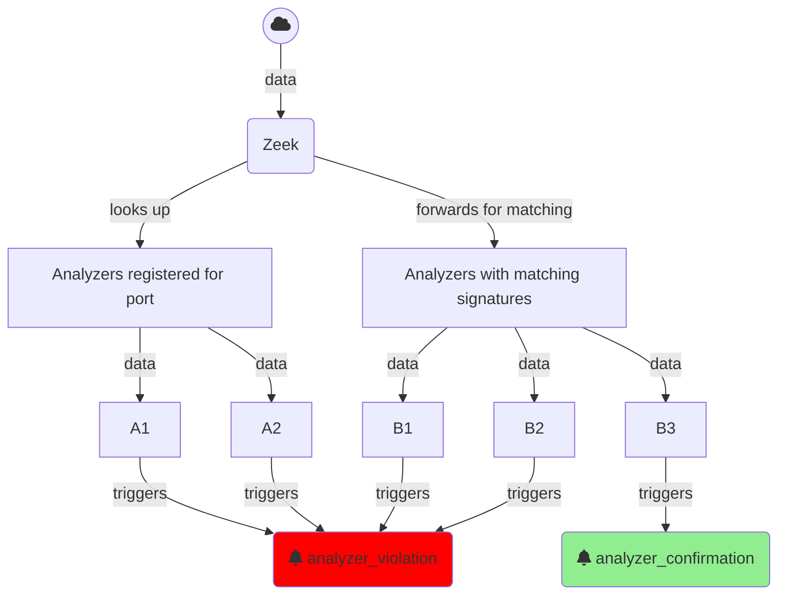

# Analyzer lifecycle

In Zeek's model all eligible analyzers would see the traffic.

- If analyzers detect traffic not matching their protocol, they should signal
  Zeek an analyzer violation so they stop receiving data. This is not an error
  during protocol detection.
- To signal matching traffic analyzers should signal Zeek an analyzer
  confirmation. This e.g., leads to associating the protocol/service with the
  connection.



To integrate the parser into this the template generated the following stub implementations in `analyzer/zeek_*.spicy`:

```spicy
# TODO: Protocol analyzers should confirm once they are reasonably sure that
# they are indeed parsing the right protocol. Pick a unit that's a little bit
# into the parsing process here.
#
# on Foo::SUITABLE_UNIT::%done {
#     zeek::confirm_protocol();
# }

# Any error bubbling up to the top unit will trigger a protocol rejection.
on Foo::Request::%error {
    zeek::reject_protocol("error while parsing Foo request");
}

on Foo::Response::%error {
    zeek::reject_protocol("error while parsing Foo reply");
}
```

We can use
[`zeek::confirm_protocol`](https://docs.zeek.org/en/master/devel/spicy/reference.html#spicy-confirm-protocol)
and
[`zeek::reject_protocol`](https://docs.zeek.org/en/master/devel/spicy/reference.html#spicy-reject-protocol)
to signal Zeek.
